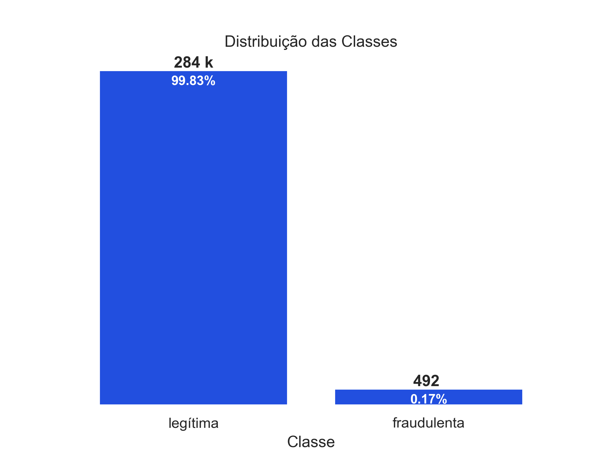

[](www.linkedin.com/in/jean-augusto-morais)
[](https://www.python.org/)

# Projeto - Identificação de fraudes

Este projeto tem como objetivo prever fraudes em transações financeiras, utilizando técnicas de análise de dados e algoritmos de machine learning supervisionado. Através de etapas como pré-processamento, engenharia de atributos, balanceamento de classes e avaliação de modelos, buscamos identificar comportamentos suspeitos com alta precisão.

**Algumas Observações:**
- A base de dados utilizada está desbalanceada, ou seja, há uma proporção significativamente menor de casos de fraude em relação aos casos legítimos, o que exige cuidados específicos na modelagem.
- Os nomes das colunas foram substituídos ou anonimizados para garantir a segurança e a privacidade das informações sensíveis(colunas de v1 a v28).




🔗 [Acesse o dataset no Kaggle](https://www.kaggle.com/mlg-ulb/creditcardfraud)

Nesse projeto foi ultilizado varias bibliotecas do Python como: Matplotlib, NumPy ,Pandas ,Scikit-Learn ,Seaborn.

<p align="center"> 
  <a href="www.linkedin.com/in/jean-augusto-morais" target="_blank"></a> 
</p>

## Objetivos

### 🎯 Objetivo do Projeto

Este projeto tem como objetivo demonstrar a aplicação de técnicas de ciência de dados e machine learning para prever transações financeiras fraudulentas. A proposta é construir um modelo preditivo eficiente, capaz de lidar com bases de dados desbalanceadas e gerar insights que auxiliem sistemas automatizados de detecção de fraude.

Além disso, o projeto busca evidenciar boas práticas em:
- Limpeza e pré-processamento de dados;
- Engenharia de atributos;
- Avaliação de desempenho em cenários com classes desbalanceadas;
- Preservação da privacidade dos dados.

Este trabalho foi desenvolvido com foco em portfólio, para demonstrar habilidades práticas em projetos de detecção de anomalias e classificação binária.


## Estrutura do repositório

O repositório está estruturado da seguinte forma:

```
├── dados
├── imagens
├── modelos
├── notebooks
├── referencias
```

- Na pasta `dados` estão os dados utilizados no projeto. O arquivo `creditcard.zip` e `creditcard.parquet` é o dataset utilizado originalmente. Os demais arquivos são os datasets gerados durante o projeto.
- Na pasta `imagens` estão as imagens utilizadas neste README.
- Na pasta `modelos` estão os modelos gerados durante o projeto. 
- Na pasta `notebooks` estão os notebooks com o desenvolvimento do projeto. Em detalhes, temos:
  - [`01_eda.ipynb`](notebooks/01_eda.ipynb): notebook com a análise exploratória dos dados usando pandas e seaborn
  - [`02_modelo.ipynb`](notebooks/02_modelo.ipynb): notebook com o modelo de classificação do Scikit-Learn.


## Como reproduzir o projeto

O projeto foi desenvolvido utilizando o Python 3.11.4. Para reproduzir o projeto, crie um ambiente virtual com o Conda, ou ferramenta similar, com o Python 3.11.4 e instale as bibliotecas abaixo:

| Biblioteca   | Versão |
| ------------ | ------ |
| Matplotlib   | 3.8.0  |
| NumPy        | 1.26.4 |
| Pandas       | 2.1.4  |
| Scikit-Learn | 1.3.2  |
| Seaborn      | 0.12.2 |
